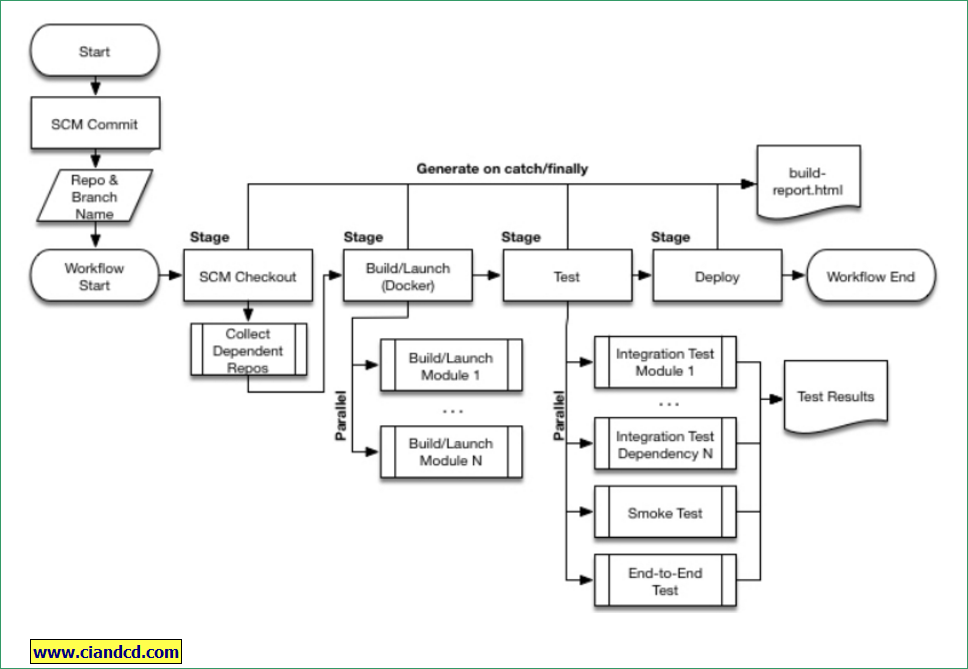
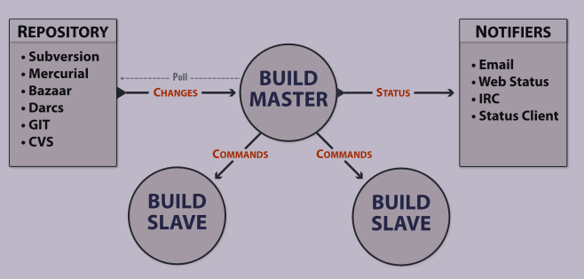
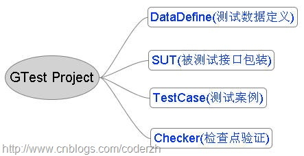

# 持续集成与单元测试工具的选择

本文对持续集成（CI）、代码分析工具、单元测试工具进行了比较:

持续集成工具包括， Jenkins，buildbot， CDash;
代码分析工具包括， PC-Lint，Linux_gcov， Windows_OpenCppCoverage;
单元测试工具包括， google test tools，Boost test， cpputest tools，unittest-cpp;
<!-- more -->

## 持续集成工具介绍：

### 1)[Jenkins](https://jenkins.io/)

+ 基于Java开发的一种持续集成工具
+ 开源，即免费
+ 支持多种平台（windows、linux、os x都支持）
+ 安装、配置简单
+ Web可视化管理界面，并且有丰富的tips帮助信息
+ 标准的master/slave模式，用户与master交互，master将job分布到slave上运行

### 2)[buildbot](http://buildbot.net/)

+ 基于Python开发的一种持续集成工具, 它只依赖python环境和Twisted
+ 许多有名的开源项目，使用此工具（比如Python、MongoDB、SVN、OpenVPN、GDB、Firefox、Chrome等）


### 3)[CDash](http://www.cdash.org/)

+ 基于CMake开发的一个持续集成工具
+ 依赖的一些开源外部程序：
	* MySQL (5.x and higher) or PostGreSQL (8.3 and higher)
	* PHP (5.2 and higher)
	* XSL module for PHP
	* cURL module for PHP (for site statistics)
	* GD module for PHP (for regression tests)

## 持续集成工具使用：

### 1)[Jenkins](https://jenkins.io/)

+ 安装较为简单（实际在windows上一个安装包搞定）
+ 各种插件非常丰富，能满足大多数的需求
+ 具体的演示网址：http://127.0.0.1:8080/
	* 演示插件列表
	* 演示任务配置（svn库设置，编译脚本，以及自动构建触发机制）
	* 浏览之前构建的命令行输出
+ 具有强大的pipeline，它基于groovy脚本，灵活，可扩展的持续发布（CD）工作流：



### 2)[buildbot](http://buildbot.net/)

+ 为master/slave模式，用户与master交互，job只能在slave上运行

+ 虽然依赖的外部库不多，但是所需要的python库很多，配置复杂（我在Windows短时间内没配起来，Linux也是手动才配起来）
+ 具体的功能设置不够直观，就如在写python程序，WEB页面配置非常简陋：
+ 演示网址：
+ 演示配置文件(比较工具)：

### 3)[CDash](http://www.cdash.org/)

+ 没有具体使用，但是可以知道依赖程序较多

## 持续集成工具比较：

根据使用的经验，Jenkins上手较为容易，插件非常丰富，尤其是配置几乎全部可以在WEB上操作，可以说很好用。
而BuildBot虽然有很多有名的开源软件在使用，但是对于初学者，门槛很高，配置非常不方便，可以这样比喻：
Jenkins就像Windows, 上手容易，功能丰富。而 BuildBot就如Linux，可配性非常高，但是需要一定的Python编程基础。

	
## 单元测试代码分析工具：

### 1)[PC-Lint](https://github.com/heroanxiaobo/PC-Lint)

### 2)[Linux_gcov分析代码覆盖率](https://github.com/gcovr/gcovr)
+ [GCC---gcov、lcov与genhtml 使用心得](http://blog.sina.com.cn/s/blog_7e4ac8b501018b27.html)

### 3)[Windows_OpenCppCoverage分析代码覆盖率](https://opencppcoverage.codeplex.com/)

+ [介绍](http://www.cnblogs.com/coderzh/p/OpenCppCoverage.html)

+ [官网](https://opencppcoverage.codeplex.com/)

## 单元测试框架使用：

### 1)google test tools

#### C++语言-google mock：
+ 特性功能：
	- 轻松地创建mock类
	- 支持丰富的匹配器（Matcher）和行为（Action）
	- 支持有序、无序、部分有序的期望行为的定义
	- 多平台的支持
	
+ 简单示例：

``````````````````````````````
	//接口类
	class FooInterface {
	public:
			virtual ~FooInterface() {}

	public:
			virtual std::string getArbitraryString() = 0;
	};
	
	//打桩类
	class MockFoo: public FooInterface {
	public:
			MOCK_METHOD0(getArbitraryString, std::string());
	};
	} 
	
	//测试
	int main(int argc, char** argv) 
	{	
		//初始化一个Google Mock
		::testing::InitGoogleMock(&argc, argv);
		string value = "Hello World!";
		//声明一个MockFoo的对象：mockFoo
        MockFoo mockFoo;
		//是为MockFoo的getArbitraryString()方法定义一个期望行为，
		//其中Times(1)的意思是运行一次，WillOnce(Return(value))的意思是
		//第一次运行时把value作为getArbitraryString()方法的返回值。
        EXPECT_CALL(mockFoo, getArbitraryString()).Times(1).WillOnce(Return(value));
        string returnValue = mockFoo.getArbitraryString();
        cout << "Returned Value: " << returnValue << endl;
        return EXIT_SUCCESS;
	}
``````````````````````````````

#### C++语言-google test 

+ 不支持VC6.0

+ 提供了良好的事件机制：
	* 全局的，所有案例执行前后
	* TestSuite级别的，在某一批案例中第一个案例前，最后一个案例执行后
	* TestCase级别的，每个TestCase前后

+ 提供了测试数据参数化的机制（能够容易的将测试数据和测试接口分离）

+ 提供了异常测试机制（可以在一个安全的环境下执行崩溃的测试案例）

+ 拥有良好的运行参数设置，可以对环境变量，输出格式、测试用例等进行设置


+ 简单示例：

``````````````````````````````
    
    #include <gtest/gtest.h>
    
	TEST(FooTest, HandleNoneZeroInput)
	{
		EXPECT_EQ(2, Foo(4, 10));
		EXPECT_EQ(6, Foo(30, 18));
	}

	int _tmain(int argc, _TCHAR* argv[])
	{
		//初始化gtest
		testing::InitGoogleTest(&argc, argv);
		//运行测试用例
		return RUN_ALL_TESTS();
	}
``````````````````````````````


#### C语言---cmockery

+ 轻量级框架，兼容性强，适合各种编译器

+ 简单示例：

``````````````````````````````
	//测试对象
	int add(int a, int b)   
	{  
		return a + b;  
	} 

	#include <cmockery.h>  

	//测试用例
	void test_add(void **state) {  
		assert_int_equal(add(3, 3), 6);  
		assert_int_equal(add(3, -3), 0);  
	}  
	int main(int argc, char *argv[])   
	{  
		//添加测试用例
		const UnitTest tests[] = {  
			unit_test(test_add),      
		};  
		//运行测试用例
		return run_tests(tests);  
	}  
``````````````````````````````
	
#### 测试工程组织形式： 


+ DataDefine:测试案例所需要的数据
+ SUT:测试对象，它可以是一个类(CUT)，对象(OUT)，函数(MUT)，甚至可以是整个应用程序(AUT)。
+ TestCase:必须非常明确的表示出哪些是测试案例，哪些是其他的辅助文件。
+ Checker:抽象出一些通用的检查点代码


### 2)Boost test

#### 自身特性：
+ 移植性不好，需要stl, rtti, Boost支持，而且编译出的程序比较大
+ 提供了内存检测机制
+ 拥有目前最好异常测试机制, 能够很好的处理各种异常状况
+ 提供测试用例，测试夹具，测试套件等概念，并能够以任意的复杂度组织它们
+ 支持命令行，可以指定运行任意一个测试套件或测试用例
+ 测试信息可以显示为多种格式，如平文件或者xml格式


#### 简单示例：

``````````````````````````````
	#include <boost/test/included/unit_test.hpp>

	//测试套件
	BOOST_AUTO_TEST_SUITE (stringtest)

	//测试用例
	BOOST_AUTO_TEST_CASE (test2)
	{
		mystring s;
		s.setbuffer("hello world");
		BOOST_REQUIRE_EQUAL ('h', s[0]); // basic test 
	}

	BOOST_AUTO_TEST_SUITE_END( )
``````````````````````````````


### 3)cpputest tools

#### cpputest

+ 开源社区支持力度小
+ 使用简单，用法灵活
+ 仅仅使用少量的C++特性，可移植性好，能同时用于C和C++
+ 支持测试用例和测试套件的层次结构
+ 不支持运行参数设置，但是能够提供屏蔽测试用例关键字
+ 提供检测内存泄露机制

+ 代码示例：

``````````````````````````````
	#include "CppUTest/CommandLineTestRunner.h"
	//测试用例
	TEST(FirstTestGroup, SecondTest)
	{
		STRCMP_EQUAL("hello", "world");
	}
	int main(int ac, char** av)
	{
		//运行测试用例
		return CommandLineTestRunner::RunAllTests(ac, av);
	}
``````````````````````````````


#### cpputest_gmock

+ 提供简单的打桩功能
+ 仅仅使用少量的C++特性，可移植性好，能同时用于C和C++
+ 简单示例：

``````````````````````````````
	#include "CppUTest/TestHarness.h"
	#include "CppUTestExt/MockSupport.h"

	TEST_GROUP(MockDocumentation)
	{
		void teardown()
		{
			mock().clear();
		}
	};

	void productionCode()
	{
		mock().actualCall("productionCode");
	}

	TEST(MockDocumentation, SimpleScenario)
	{
		mock().expectOneCall("productionCode");
		productionCode();
		mock().checkExpectations();
	}
``````````````````````````````


### 4)unittest-cpp

+ 代码短小简洁，容易掌握，可看做cppunit的简化版
+ 提供了测试套件和测试夹具机制
+ 使用示例：

``````````````````````````````
	#include "UnitTest++/UnitTestpp.hpp"

	UnitTest::RunAllTest();

	class TestUnitTest {
	public:
		TestUnitTest(int i, int j) : a(i) , b(j) {}
			TestUnitTest() : a(1) , b(2) {}
			int GetAddResult() {return a+b;}
			int GetSubResult() {return a-b;}
	private:
		int a, b;
	};

	SUITE(TestSuite)
	{
		TEST(SimilarlyNamedTestsInDifferentSuitesWork)
		{
			CHECK( 1 == 1);
			CHECK_EQUAL( 0 , 1);
		}

		TEST_FIXTURE(TestUnitTest, SimilarlyNamedFixtureTestsInDifferentSuitesWork)
		{
			CHECK(TestUnitTest(1,2).GetAddResult() ==3);
			CHECK(GetAddResult() == 3);
		}
	}

	int main(int, char const *[])
	{
		return UnitTest::RunAllTests();
	}		
``````````````````````````````

  


## 单元测试框架比较：


| 特性 | google test tools |  Boost test |  cpputest tools  | unittest-cpp  |
| --- | ----- | ---- |---- |----  |
| 代码复杂度    |   一般                |  代码非常复杂，不易查错                           |  代码简单      | 代码简单       |
| 支持C语言    |    必须使用cmockery支持               | 不支持                           |  支持      |  支持      |
| Mock支持    |    使用google mock               |   不支持                         |  支持（以外部库形式）      |  不支持      |
| 依赖性    |      依赖标准库             |   需要stl, rtti, Boost支持   |  依赖有限C++特性      |     依赖有限C++特性   |
| 程序生成大小    | 一般                  |  非常大（整个boost库太大）                          |    一般    |  一般      |
| 内存检测机制    | 无                  |    有                        |  支持      |  支持      |
| 测试套件    |   非常完善               |   非常完善                        |  支持      | 支持       |
| 开源支持力度    | 强                  |   强                         |  有，开发人员较少      |   有，开发人员较少     |
| 异常测试能力    | 好                  |   非常好                         | 一般       |  一般      |
| 测试数据参数化    | 支持                  |  支持                          |  无      |    无    |
| 运行参数设置    |   支持                |   支持                         |   无     |    无    |
| VC6.0支持    |     不支持              |   不支持                         |  支持      |    支持    |

